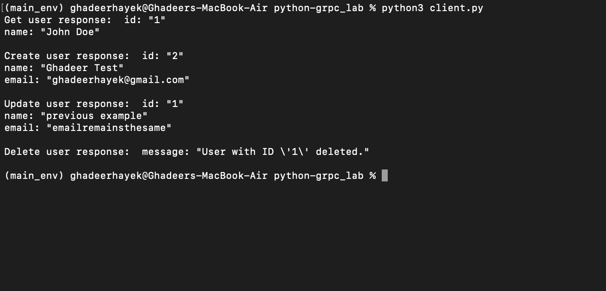
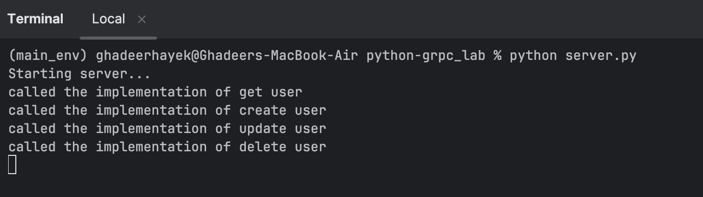

# **Distributed Systems Lab — Phase 3 - High-Performance RPC with gRPC**

This service implements a high-performance User service using the gRPC framework.
It defines a strict service contract with Protocol Buffers (`.proto` file) and provides `CreateUser` and `GetUser` RPC methods.

## Technologies used

- Python = 3.10 
- grpcio==1.60.0
- grpcio-tools==1.60.0
- protobuf>=4.21.0 

### How to run standalone? 
Quick testing without docker. 

1.  Navigate to this directory (`/python-grpc-lab`).

2. install the required dependices 

    
    `pip3 install -r requirements.txt`

3. Start the gRPC server on one terminal:

        `python3 server.py `

4. In a separate terminal, run the client to make RPC calls:

        `python3 client.py`

### How to run using docker? 
A `DockerFile` is included to containerize the server component of this phase. This allows it to be managed and run by the main 
`docker-compose.yml` file at the project root. 

| Command                                     | Description                                                                                                            |
|:--------------------------------------------|:-----------------------------------------------------------------------------------------------------------------------|
| **`FROM python:3.10-slim`**                 | *Starts from the official lightweight Python 3.10 image.*                                                              |
| **`WORKDIR /app`**                          | *Sets the working directory inside the container to `/app`.*                                                           |
| **`COPY requirements.txt .`**               | *Copies requirements.txt file from the current directory on the machine to current directory on the container `/app`.* |
| **`RUN pip3 install -r requirements.txt `** | *Installs dependencies.*                                                                                               |
| **`COPY . .`**                              | *Copies the application code into the container.*                                                                      |
| **`CMD ["python", server.py]`**             | *Runs the Flask server file*                                                                                           |

## **Output**
**Client terminal:** 

**Server terminal:**

