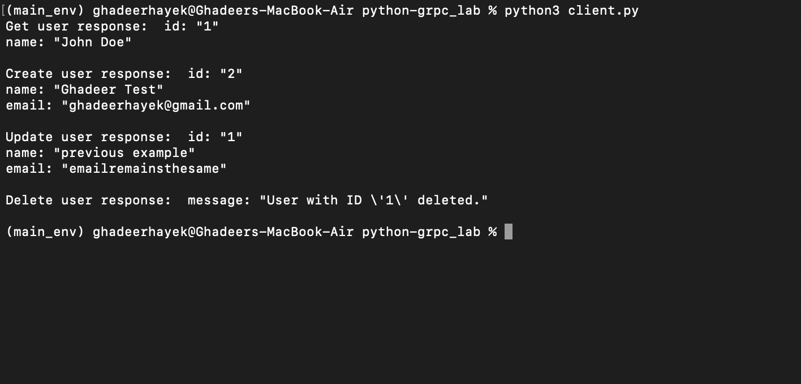
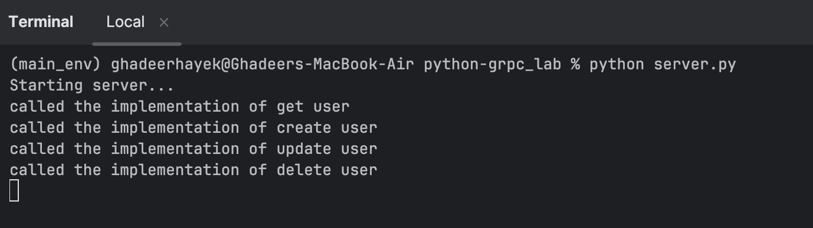

# **Distributed Systems Lab—Phase 3**

This directory contains the code for the gRPC implementation.

## **protos**

In grpc, we need to define the protocol buffer files.
In this directory, you'll find the following files:
- user_service.proto
    contains the definition of the user service and its endpoints. 
    This file is used to generate the server and client code. 

- The analogy here is that this file is the menu of the kitchen. 

## **generated**

- This directory contains the generated code.
it's generated by the protoc compiler. By executing the following command:
```
    // pwd: python-grpc_lab

    python3 -m grpc_tools.protoc -I./protos --python_out=./generated --grpc_python_out=./generated ./protos/user_service.proto
```

- Once the command is executed, the generated directory will contain the following files:
    - user_service_pb2.py -> contains the definition of the user service and its endpoints.
    - user_service_pb2_grpc.py -> contains the implementation of the user service.

- The analogy here is that this directory is the order forums for the client to order, and the call to to the kitchen to prepare that order. 


## **server.py**
- This file contains the actual implementation of the user service, it inherits the class UserServiceServicer from the user_service_pb2_grpc class in the generated code.
- the four services which we defined in the proto file are implemented in this file.
  - create_user
  - get_user
  - update_user
  - delete_user

- The analogy here is that this file is the kitchen


## **client.py**
- This file contains the client implementation.
- The analogy here is that this file is the client.


## **Testing the code**

The key idea is that the server is running on a specific port, with all the service implemented. 
And the client establishes a secure connection with the server using the same port number, and then call for the client stub to execute the service. 

- Two terminals: one running the server, and the other running the client.
- Get the client to connect to the server.
- Execute the client stub to call the service.


## **Output**

Here's an example of the output:


## **Output**
**Client terminal:** 



**Server terminal:**


