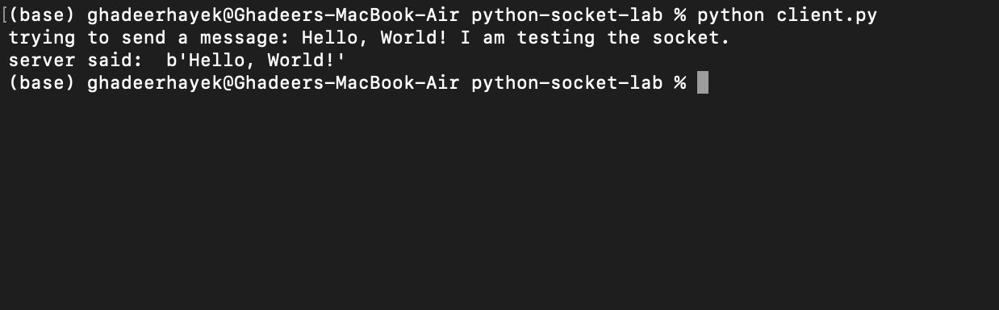

# **Distributed Systems Lab — Phase 1 - Socket-Based Communication**

This service implements a synchronous communication using Python's low-level socket library. 
The client sends a message, and the server receives it and sends an uppercase version of the message back.

## Technologies used

- Python = 3.10 

### How to run standalone? 
Quick testing without docker. 

1.  Navigate to this directory (`/python-socket-lab`).

2. you need two terminals to run the code. 

One terminal starts the server: 

        `python3 server.py `

and the other terminal runs the client to send a message:

        `python3 client.py `

in this terminal, you will see the server's response. 

### How to run using docker? 
A `DockerFile` is included to containerize the server component of this phase. This allows it to be managed and run by the main 
`docker-compose.yml` file at the project root. 

| Command                         | Description                                                  |
|:--------------------------------|:-------------------------------------------------------------|
| **`FROM python:3.10-slim`**     | *Starts from the official lightweight Python 3.10 image.*    |
| **`WORKDIR /app`**              | *Sets the working directory inside the container to `/app`.* |
| **`COPY . .`**                  | *Copies the application code into the container.*            |
| **`CMD ["python", server.py]`** | *Runs the server file*                                       |

    
## **Output**
Client terminal: 

Server terminal:

